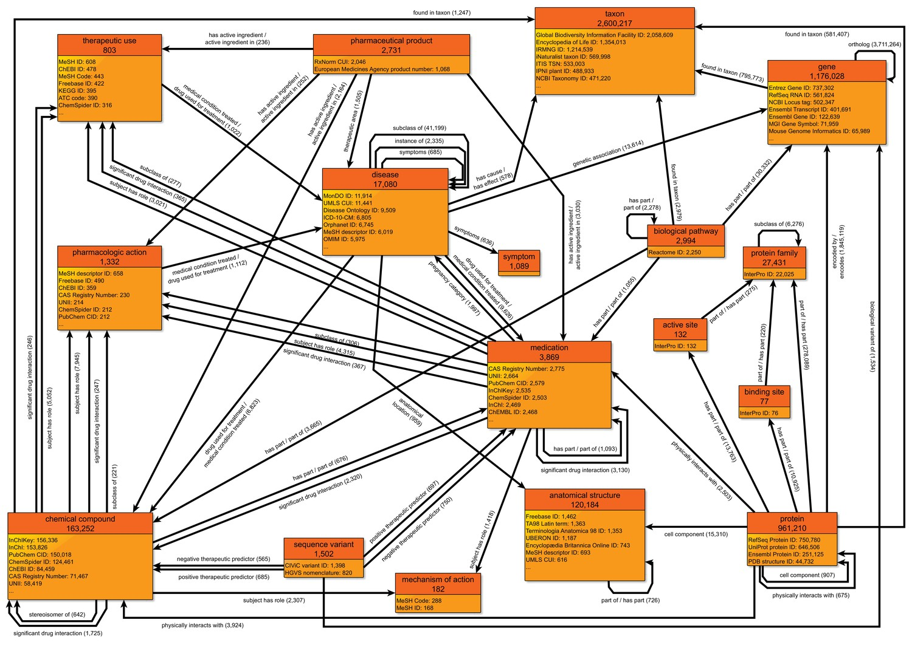
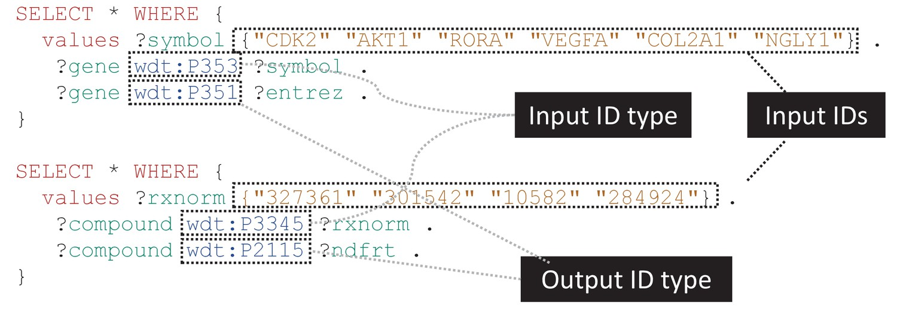
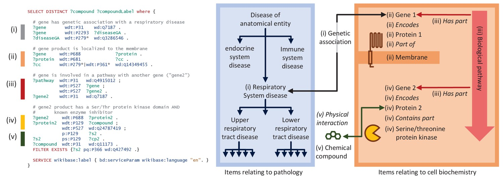
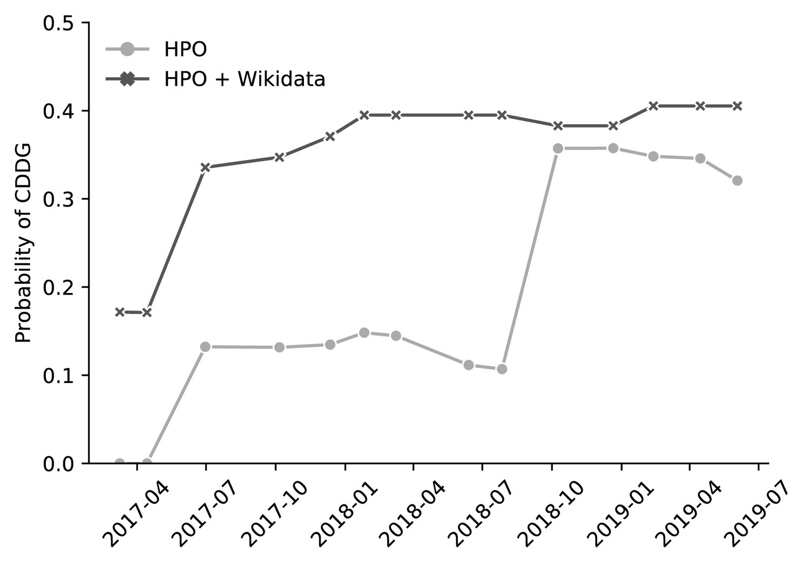
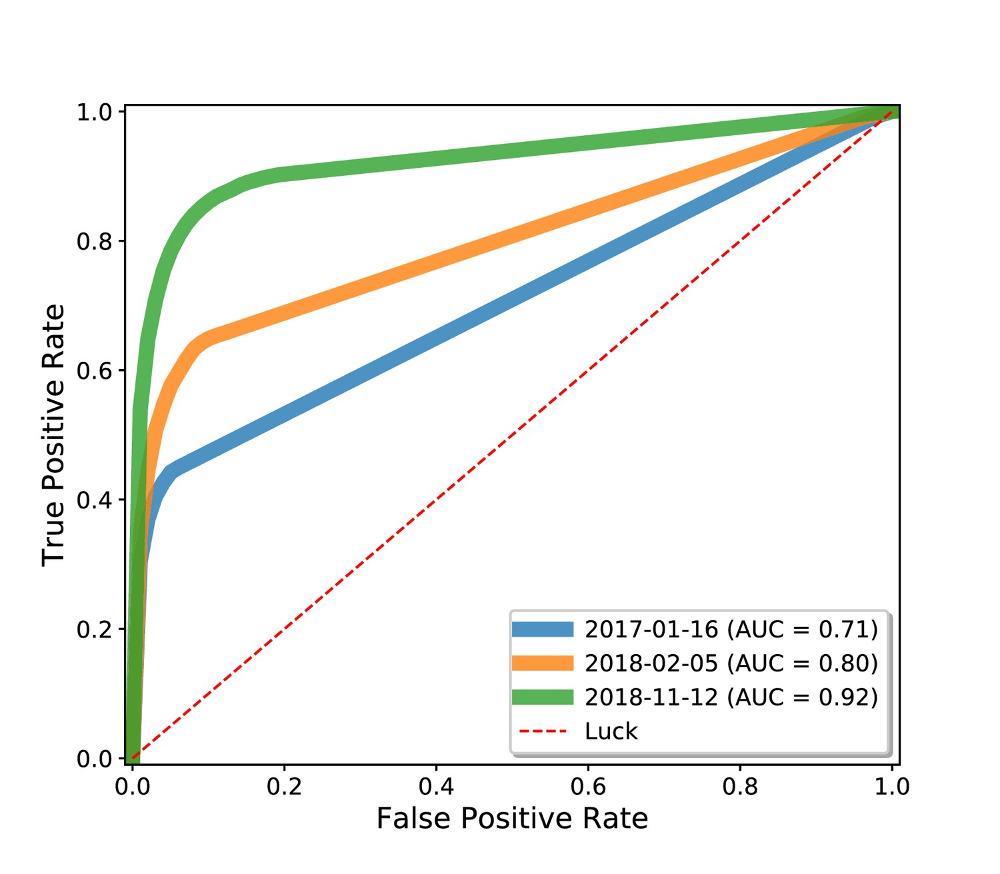

class: center

```{r setup, include=FALSE}
options(htmltools.dir.version = FALSE)
```

```{r xaringan-themer, include=FALSE, warning=FALSE}
library(xaringanthemer)
style_duo(
  primary_color = "#F97B64", secondary_color = "#1F4257",
  header_font_google = google_font("Josefin Sans"),
  text_font_google   = google_font("Montserrat", "300", "300i"),
  code_font_google   = google_font("Fira Mono")
)
```

# Wikidata as a knowledge graph for the life sciences

<div style="display: flex;align-items: center;justify-content: center;margin: 5rem 0;">


</div>

### João Vitor Ferreira
### Dalmolin Lab, BioME
**24-03-2021**

---
class: inverse

## O que é a Wikidata?

- Uma base de conhecimento *crowdsourced* integrada na web semântica

- Traz informações sobre inúmeras áreas, da linguística até
  a proteômica
  
- Funciona à base de RDF (*Resource Description Framework*) e pode ser consultada com SPARQL

<iframe src="https://www.wikidata.org/wiki/Wikidata:Main_Page" style="width:100%;height:50%;"></iframe>

---
class: center

## Itens na Wikidata


---
class: inverse




---

## De onde vem esses dados?

* **Genes e Proteínas**: RefSeq, Genebank, Ensembl, Intepro, PDB, GO e Uniprot (Esse último que também utiliza RDF!);
* **Variantes gênicas**: CiViC, dbSNP;
* **Vias**: Reactome, Wikipathways;
* **Doenças**: HDO, MDO;

<div style="display: flex;align-items: center;justify-content: center;margin: 0.5rem 0;">


</div>

--

* **Tipos celulares**: Human Cell Atlas e PanglaoDB.

---

## Conversão de identificadores


<iframe style="width:100%;height:30%;" src="https://query.wikidata.org/embed.html#SELECT%20%2a%20WHERE%20%7B%0A%20%20VALUES%20%3Fsymbol%20%7B%0A%20%20%20%20%22CDK2%22%0A%20%20%20%20%22AKT1%22%0A%20%20%20%20%22RORA%22%0A%20%20%20%20%22VEGFA%22%0A%20%20%20%20%22COL2A1%22%0A%20%20%20%20%22NGLY1%22%0A%20%20%7D%0A%20%20%3Fgenewdt%20wdt%3AP353%20%3Fsymbol%3B%0A%20%20%20%20wdt%3AP351%20%3Fentrez.%0A%7D" referrerpolicy="origin" sandbox="allow-scripts allow-same-origin allow-popups" ></iframe>

---
class: inverse

## O que essa integração pode proporcionar?

* Um pulmonologista está interessado em identificar compostos químicos para testar em modelos animais de doença



* Informações agregadas do GO, GWAS Catalog, Human Disease Ontology, Wikipathways, IUPHAR e Interpro numa única consulta.


---
class: center, inverse

## Diagnóstico baseado em fenótipos



---
class: center

## Reposicionamento de fármacos



---
class: inverse

## Wikidata para informações acadêmicas?

<iframe src="https://scholia.toolforge.org/" style="width:100%;height:60%;"></iframe>

---
class: inverse

## Wikidata para informações acadêmicas?

<iframe src="https://scholia.toolforge.org/author/Q59166361" style="width:100%;height:60%;"></iframe>

---

## Enfim...

* A Wikidata apresenta um enorme potencial como um repositório FAIR de dados científicos;

* Torna mais acessível iniciativas de biocuradoria;

* A integração de dados inerente à ela facilita e potencializa a pesquisa científica.

---
class: center

# Wikidata as a knowledge graph for the life sciences

<div style="display: flex;align-items: center;justify-content: center;margin: 5rem 0;">


</div>

### João Vitor Ferreira
### Dalmolin Lab, BioME
**24-03-2021**