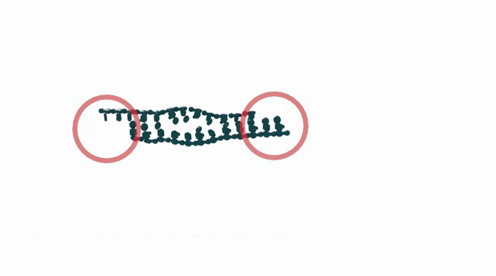
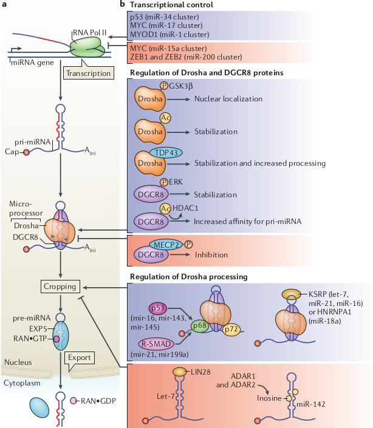
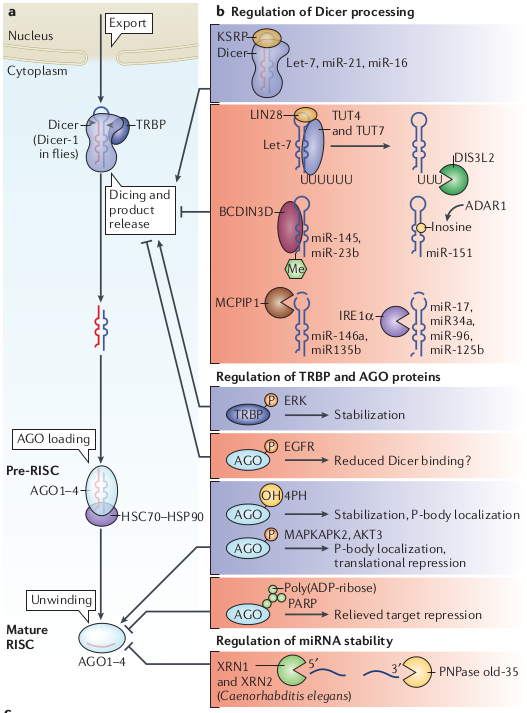
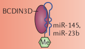
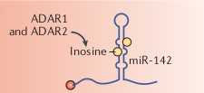
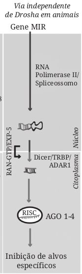
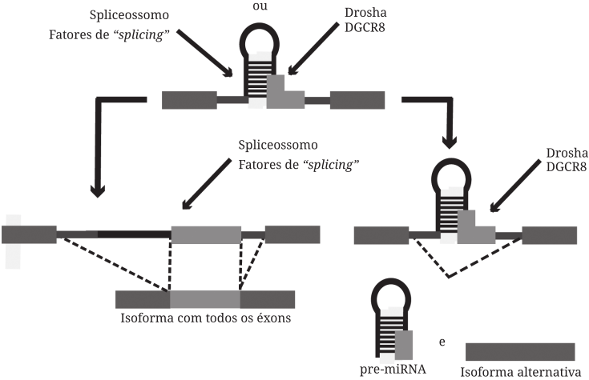
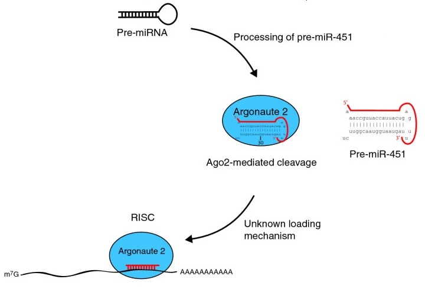
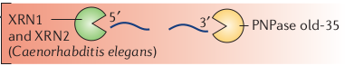

name: titulo
class: left, middle
background-image: url(./pics/bg.png)
background-size: cover

```{r setup, include=FALSE}
options(htmltools.dir.version = FALSE)
```

# ncRNA 🧬🧬 

### .fancy[Biogênese dos miRNA]

</br>
<hr style="border: 0; border-top: 1px solid black">

.large[<b>João Vitor Ferreira Cavalcante | UFRN | 23/06/2020</b>]

<!-- this ends up being the title slide since seal = FALSE-->

---
<!-- class: inverse -->

# Alguns conceitos básicos...

.center[]

- A forma inicial do miRNA (pri-miRNA) geralmente é transcrita pela RNAPol II 🧬

--
  - E pode ter mais de 1000 nt!
--

- Porém, também existem aqueles transcritos pela RNAPol III, como os miRNAs virais
--

- Além dos que são formados por fragmentos de tRNAs (Barbiaz, 2008) e... **Enfim, muitas possibilidades!**

---
class: center, middle, inverse

# OK! Mas me deixa ver como é esse processo!
  
---
class: center, middle, inverse

# Cropping


???

Créditos das imagens: [Oxford Academic](https://www.youtube.com/watch?v=5YsTW5i0Xro)

---
class: center, middle, inverse

# Exportação e Processamento Citoplasmático


---
class: center, middle, inverse

# Formação do miRISC


--

.left[
Mas todo esse processo é fortemente regulado...
]

---
class: inverse

# Regulação


- Assim como mRNAS, a transcrição de miRNAs pode ser controlada por fatores de transcrição e modificações epigenéticas

  - Existem, inclusive, circuitos de feedback com o miRNA e seus FTs!
  
- Já se foram observadas regulações alternativas em situações de estresse, como câncer ou hipóxia (Shen et al, 2013)


---
class: center, inverse


---
class: center, inverse


---
class: inverse
# Modificações pós-transcricionais

- **Modificações na cauda Poli-A** podem interferir com o procesamento por Dicer ou Drosha, como é observado com a adição de uracila na cauda do let-7.
--

- **Metilação** podendo ocorrer tanto na 3' quanto 5'

  - Talvez o caso mais interessante em humanos seja a metilação 5' do pre-miR-145, ela impede o processamento da DICER e a funcionalidade do miRNA, que age como supressor tumoral no câncer de mama.
  
  .center[]
--

- **Edição** alterações no RNA sem envolver mutações no DNA codificador.

.center[]

---
class: inverse
# Vias não canônicas da biogênese
--
.left-column[

]
--
.right-column[

]
---
class: center, inverse
# Vias não canônicas da biogênese


---
class: center, inverse
# Vias não canônicas da biogênese



???

Fontes: Ender et al, 2013. Dueck e Maester, 2010.

---
class: inverse
# Degradação
- Pela AGO ser um componente indispensável da função dos miRNAs, muitas vezes ela é o alvo para regulação negativa.
  
  - Ubiquitinação
  - A fosforilação anômala a impede de interagir com DICER
  
--

- Porém os miRNAs em si também podem ser alvos da degradação
  - XRN-2 em *C. elegans*
  - Existem, no entanto, muitos mecanismos ainda desconhecidos, como a degradação de miR-29b durante o ciclo celular (Hwang et al, 2007) e miR-27a durante a infecção por MCMV (Buck et al, 2010).
.center[

]