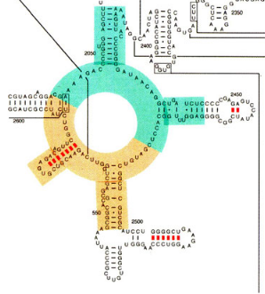
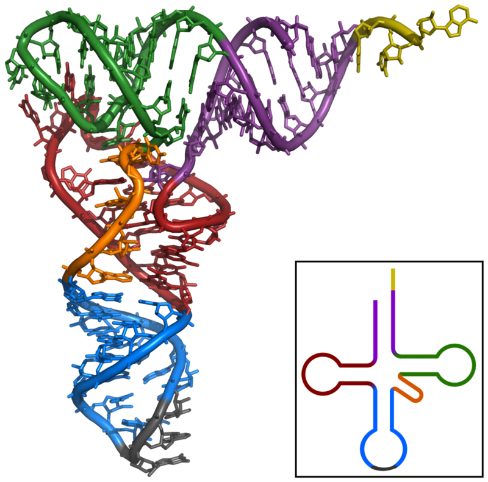
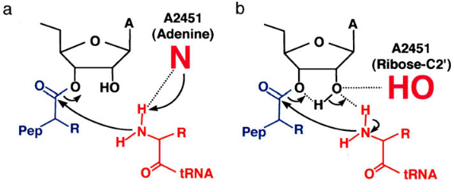
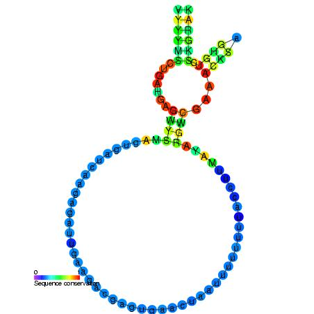
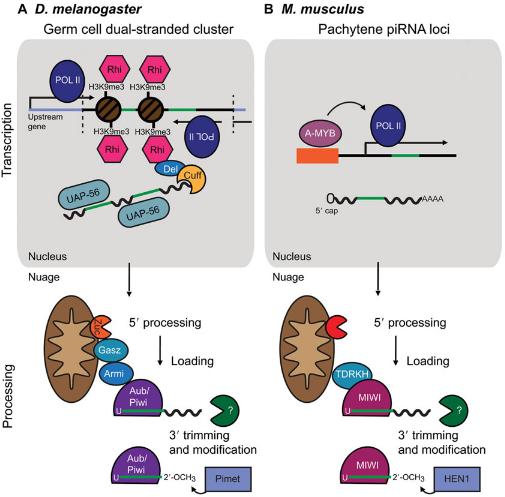
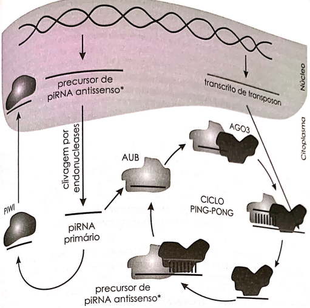
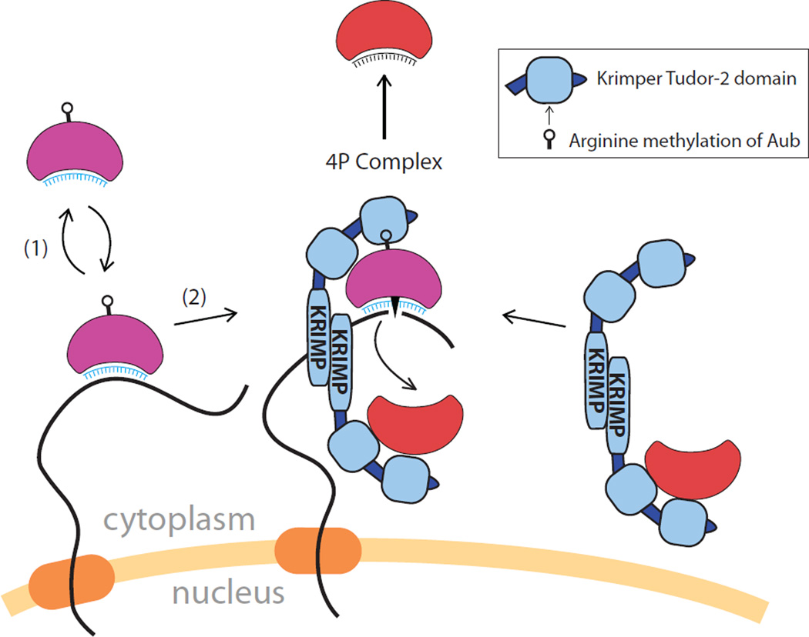
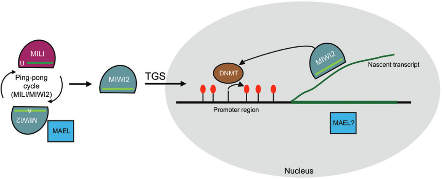
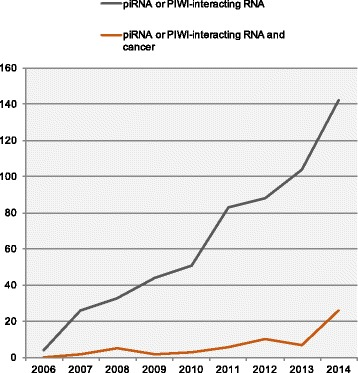
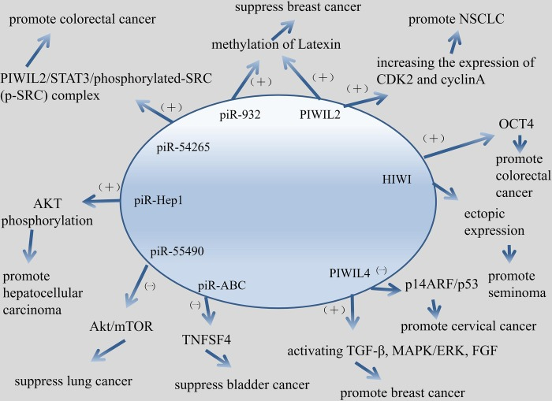

name: titulo
class: left, middle
background-color: #E6E6FA

```{r setup, include=FALSE}
options(htmltools.dir.version = FALSE)
library(RefManageR)
BibOptions(check.entries = FALSE, bib.style = "authoryear", style = "markdown",
           dashed = TRUE)
bib <- ReadBib("ref.bib")
```

# ncRNA 🧬🧬 

### .fancy[Ribozimas e piRNAs]

</br>
<hr style="border: 0; border-top: 1px solid black">

.large[<b>João Vitor Ferreira Cavalcante | UFRN | 10/07/2020</b>]

<!-- this ends up being the title slide since seal = FALSE-->

---
class: center, middle, inverse

# Ribozimas
---
<!-- class: inverse -->

# O ribossomo - surgimento e evolução

- Está entre as estruturas celulares mais antigas.

- Seu centro catalítico, ou **PTC**, se origina antes até das próprias células organizadas.

--
  - Alguns grupos de pesquisa sugerem que sua formação se deu pela união de tRNAs. `r Citep(bib, "Farias_2014")`
  - Essa hipótese se deu inicialmente devido à estrutura secundária do PTC ser similar em tamanho e forma aos tRNAs de hoje. `r Citep(bib, "Tamura_2011")`
  
  .pull-left[] 
  .pull-right[]
  
---
# O ribossomo - estrutura e função

- Duas subunidades, a maior sendo 23S em procariotos e 28S em eucariotos

- A reação catalítica do ribossomo é uma reação ácido-base, acontecendo da seguinte maneira:

.center[]
.center[`r Citep(bib, "Tamura_2011")`]

--
- Foi mostrado que a ausência da 2'OH da ribose da A2451 impede a realização da sua função.

--
- Apesar de grande parte do trabalho aparentar ser feito pela subunidade maior, o posicionamento correto do tRNA se dá pela subunidade menor.

???
N1 ou N3 da adenina captura um próton do grupo alfa-amino do tRNA aminoacilado, aumentando a nucleofilia do átomo de N.
N é atacado pelo grupo carbonil do peptidil-tRNA, The 2′-OH of the A2451 hydrogen-bonds the 2′-O of the peptidyl-tRNA, and a proton moves from the α-amino group of the aminoacyl-tRNA to the 2′-O of the peptidyl-tRNA, giving its own proton to the 3′-O of the peptidyl-tRNA. 

   
---
class: inverse

# Outras ribozimas

* **M1 RNA**, que, junto ao peptídeo C5, forma a RNase P, esta agindo na maturação de tRNAs.
  * Toda a atividade catalítica é da M1 RNA!! O C5 apenas possibilita a interação desta com o substrato.
  

--
* **RNase MRP**, cuja função ainda é elusiva, é evolucionalmente relacionada à RNAse P.
  * Está associada ao processamento de pré-rRNA e está envolvida na iniciação da repl. mitocondrial.
  * Outras funções?
.center[]

???

RNAse P tem diferenças nos eucariotos (mais auxiliares). Ela cliva elementos 5' do tRNA.
---
class: inverse

# Outras ribozimas

* Viróides possuem a ribozima **Hammerhead**, que proporciona a clivagem do seu genoma, este inicialmente sintetizado como um concatâmero.

.pull-left[]
.pull-right[ 
- Por sua capacidade de clivagem de RNA, ela tem sido estudada como um possível
composto terapêutico em câncer e ALS! `r Citep(bib, "Citti_2005")`
]

???

Uma tangente, falando sobre viróides, é a teoria que eles vem de circRNAs..

---
class: center, middle, inverse

# piRNAS
---

# Histórico e Características

- Inicialmente (2001) pequenos RNAs (26-31nt) chamados de *rasiRNAs* em *Drosophila*, mudaram seu nome com a descoberta da sua interação com subfamília de proteínas PIWI, com quem formam o **piRISC**.

- Sua função mais característica e a qual foi primeiro descrita, é o controle da expressão e da transposição de transposons.

- Em grande parte, se organizam genomicamente em *clusters* intergênicos, que em seu interior possuem sequências homólogas a transposons do organismo.

.center[]

- Em mamíferos, podem ser classificados de acordo com o estágio de desenvolvimento da célula germinativa.

--
- Mas como que eles são formados?

---
class: inverse

# Biogênese - Via primária

.center[


`r Citep(bib, "Weick_2014")`
]

---
# Biogênese - Ping-pong

.center[]

???
- Ago3 geralmente carrega senso, Aub anti-senso. 

---
class: inverse

# Biogênese - Ping-pong

.center[


`r Citep(bib, "Webster_2015")`]

--
- E ainda: piRNAs gênicos; piRNA *phasing* e epiRNAs!

???
Falar sobre phasing agora. Ilustração de dois mecanismos, Aub corta e sai ou Aub é carregada no Krimper, corta e passa pra Ago3.

---
# Função biológica

* Quanto mais ativo é um transposon, maior é a probabilidade deste se inserir em um cluster de piRNA, levando possivelmente a quedas na sua atividade, por meio dos novos piRNAs formados.

* Proteção do genoma de células germinativas primordiais

.center[]

* Mutações deletérias em vias de piRNAs em *Drosophila* e camundongos reduzem ou até impossibilitam fertilidade! 
`r Citep(bib, "Brennecke_2008")`

???
Não se sabe se o pirna interage com o transcrito nascente ou com a fita de dna. MAEL n tem funçao conhecida.

---
class: inverse

# piRNAs e câncer?

.pull-left[


`r Citep(bib, "Ng_2016")`
]

.pull-right[


`r Citep(bib, "Cheng_2019")`
]

---
# Referências

```{r, results='asis', echo=FALSE}
PrintBibliography(bib[1:5])
```

---
# Referências

```{r, results='asis', echo=FALSE}
PrintBibliography(bib[6:length(bib)])
```

 
