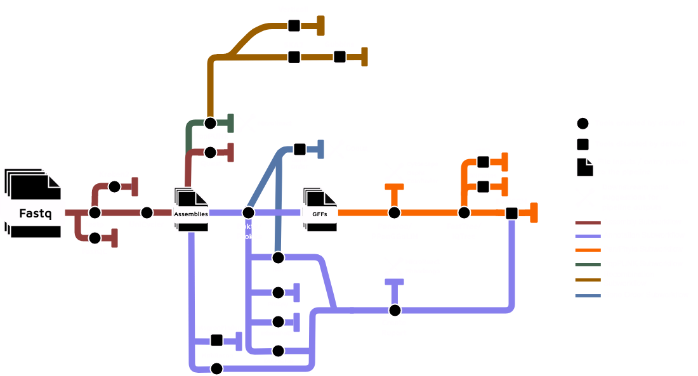

```{r setup, include=FALSE}
options(htmltools.dir.version = FALSE)
knitr::opts_chunk$set(
  fig.width=9, fig.height=3.5, fig.retina=3,
  out.width = "100%",
  cache = FALSE,
  echo = TRUE,
  message = FALSE, 
  warning = FALSE,
  hiline = TRUE
)
```

```{r xaringan-themer, include=FALSE, warning=FALSE}
library(xaringanthemer)
style_duo(primary_color = "#0F4257", secondary_color = "#F97B64")
```

```{r xaringan-animate-all, echo=FALSE}
xaringanExtra::use_animate_all("fade")
```

class: inverse center middle

# Software Project

---

# beiko-lab/ARETE

- A bioinformatics best-practice analysis pipeline for profiling the genomic repertoire and evolutionary dynamics of microorganisms with a particular focus on pathogens.
  - Pangenome inference, coevolution and lateral gene transfer analysis are some of its features. 

- Originally ideated by Finlay Maguire and Alex Manuele in 2021, mostly implemented by me from 2023 onwards.

- Intended to run in HPC environments, through Docker or Singularity.

<center></center>
---



---

# Some highlights

- Based on a customized version of the [nf-core Pipeline template](https://github.com/nf-core/tools?tab=readme-ov-file#creating-a-new-pipeline), same as the Tree of Life workflows.

- Public [documentation website](https://beiko-lab.github.io/arete/) built with [MkDocs](https://www.mkdocs.org/) and served through GitHub Pages.

- Full test suite for every subworkflow included in the pipeline, implemented in [nf-test](https://www.nf-test.com/) and executed through GitHub Actions.
  - Standard end-to-end testing is also executed in GitHub actions, for both Singularity and Docker.
  
- Different [resource allocation profiles](https://github.com/beiko-lab/arete/tree/master/conf), allowing for fine-grained customization in different environments.

- Contributions to the nf-core community, seen through modules such as [IslandPath](https://nf-co.re/modules/islandpath) and [PhiSpy](https://nf-co.re/modules/phispy), both originally implemented in this pipeline.

<center>


</center>

---
class: inverse center middle

# Mentorship Project
## Genome After-Party:
### A global database of ready-made genome analyses

---

## What skills can I contribute to the project?

.font-larger[
- I have deep knowledge of Nextflow and nf-core;

- I have extensively worked in the past, through both ARETE and other projects, in implementing analyses from researchers in workflows;

- I have implemented many wrappers in both Python and Shell in workflows I've developed, like ARETE itself;

- Through both my MSc and Undergrad research, I have become acquainted with many bioinformatics tools, which will facilitate getting started integrating them in curated workflows.
]

---
class: middle center

# Future Innovators Mentorship

## BioData Developers Network

### João Vitor Cavalcante

### May 16th, 2024
