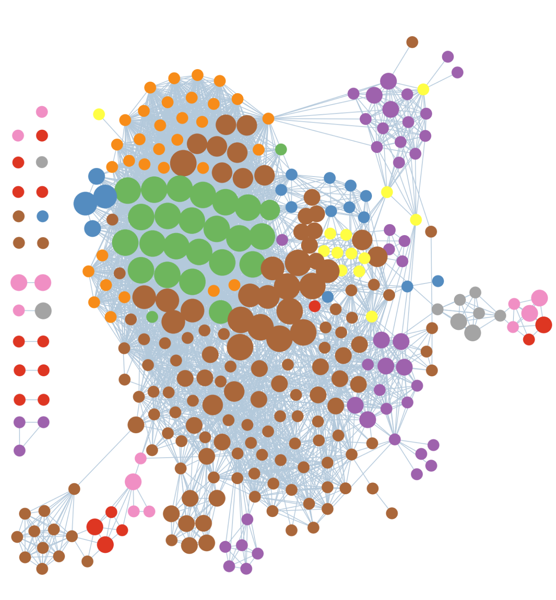
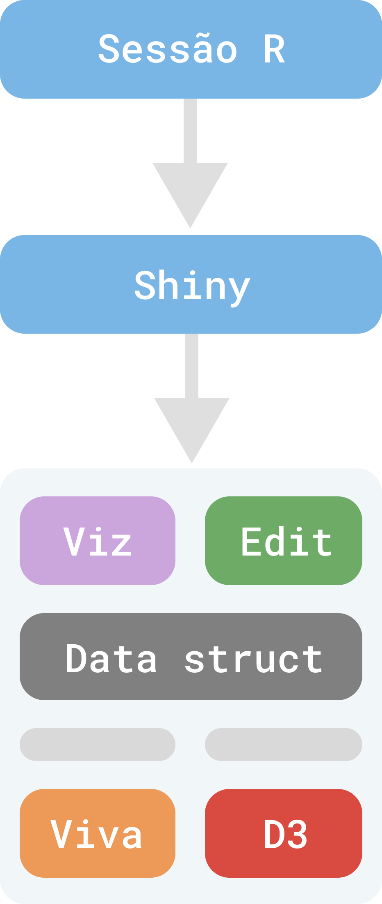
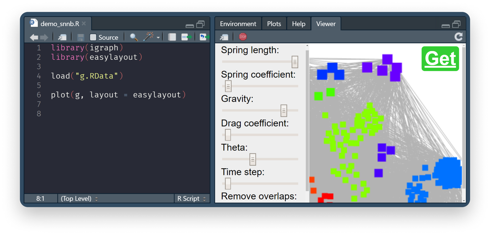

```{r setup, include=FALSE}
options(htmltools.dir.version = FALSE)
knitr::opts_chunk$set(
  fig.width=9, fig.height=3.5, fig.retina=3,
  out.width = "100%",
  cache = FALSE,
  echo = TRUE,
  message = FALSE, 
  warning = FALSE,
  hiline = TRUE
)
```

```{r xaringanExtra, include=FALSE, echo=FALSE}
xaringanExtra::use_xaringan_extra(c("tile_view", "scribble", "freezeframe"))
xaringanExtra::use_webcam(width="200px", height="200px")
```

```{r xaringan-themer, include=FALSE, warning=FALSE}
library(xaringanthemer)
style_mono_light(base_color = "#23395b")
```

## Grafos ou redes

<div style="display:grid;grid-template-columns: 1fr 1fr;gap:5%;">

- Vários fenômenos sociais e naturais podem ser representados através de uma estrutura de rede, como cadeias alimentares, comunidades sociais e interação de proteínas.

- A visualização de redes se torna indispensável ao analisar esses dados

- Soluções nativas em R para a visualização e manipulação desses dados de forma intuitiva e reprodutível são insatisfatórias

- Apresentamos a construção de um pacote em R, easylayout, para a criação de visualizações de redes que permite tanto a manipulação gráfica quanto a programática

<div class="centerify">

<p align="center">Rede montada no *easylayout*</p>
</div>
<div>


---

## Metodologia

<div style="display:grid;grid-template-columns: 1fr 1fr;gap:5%;">

- Utilizamos principalmentes dois pacotes R: Igraph (CSARDI; NEPUSZ, 2006) para criação e manipulação de grafos e Shiny (CHANG et al, 2022) para intermediar a interação entre a manipulação de redes no R e a interface gráfica em HTML

- Enquanto que para gerar a interatividade em si, construímos um *widget* em HTML, CSS e JavaScript. Para calcular o layout mais adequado para a representação gráfica e exibir a representação gráfica da rede em si utilizamos a biblioteca Javascript VivaGraphJS (KASHCHA 2011)

<div class="centerify">

<p align="center">Diagrama mostrando o funcionamento do pacote</p>
</div>
<div>

---
class: inverse

## Resultados

<div style="display:grid;grid-template-columns: 1fr 1fr;gap:5%;">

- Desenvolvemos uma ferramenta em R que permite, através de uma interface gráfica amigável e uma API intuitiva, a criação de representações gráficas de redes de forma interativa e altamente parametrizável

- A ferramenta possui a opção de transcrever as manipulações realizadas graficamente para obejetos R facilmente compartilháveis, garantindo também, dessa forma, maior potencial para reprodutibilidade

- Por utilizar a biblioteca VivaGraphJS, permitimos a manipulação de redes com alta complexidade, sem obter prejuízos observáveis em performance ou na eficiência da análise

<div>

<p align="center">Interface do pacote</p>
</div>
<div>

---
## Conclusões

- Apresentamos uma ferramenta que pode realizar a manipulação e a criação de imagens de redes de forma que não haja perda em performance nem na reprodutibilidade da análise

- Além disso, possibilitamos maior interoperabilidade com outros recursos já existentes no ecossistema R, garantindo um fluxo de trabalho mais coerente

- No entanto, além de haver possibilidade de expansão do trabalho no sentido de disponibilizar outros motores de computação de layout que não o VivaGraphJS, melhorias na interface do widget também são desejadas.

### Agradecimentos

.pull-left[


]

.pull-right[

]